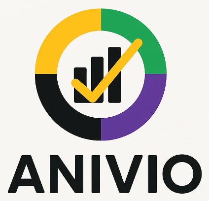

# ANIVIO - Expense Tracker & Budget Manager

<div align="center">



**A Professional, Feature-Rich Expense Tracking & Budget Management Application**

[](https://html.spec.whatwg.org/)
[](https://www.w3.org/TR/CSS/)
[](https://developer.mozilla.org/en-US/docs/Web/JavaScript)

[🎯 Live Demo](#-live-demo) • [✨ Features](#-features) • [🚀 Quick Start](#-quick-start) • [📋 Documentation](#-documentation)

</div>

---

## 🎯 Live Demo

Experience ANIVIO in action: **[Live Demo Link]()**

> ⚠️ **Note:** Add your live demo URL to the link above to deploy your application.

---

## ✨ Features

### 💰 **Expense Management**
- ➕ Add, edit, and delete expenses with ease
- 📅 Track expenses by date or month
- 🏷️ Categorize expenses (Food, Transport, Shopping, Bills, Health, Entertainment, Other)
- 🔍 Advanced search and filter capabilities
- 📝 Add detailed notes to each transaction

### 💳 **Budget Tracking**
- 🎯 Set and manage budgets by category
- 📊 Visual progress bars showing budget utilization
- ⚠️ Real-time budget status indicators
- 💵 Monthly budget overview with remaining balance tracking
- ✏️ Edit budgets on-the-fly with modal interface

### 📊 **Analytics & Insights**
- 📈 **Pie Chart:** Visualize expense distribution by category
- 📉 **Bar Chart:** Compare spending across categories
- 📉 Category-wise spending summary cards
- 💹 Total expenses and item count display
- 🎨 Color-coded category badges for quick identification

### 🎨 **Modern Design**
- 🌈 Beautiful gradient UI with violet & yellow accent colors
- 📱 Fully responsive design (mobile, tablet, desktop)
- ⚡ Smooth animations and transitions
- 🎯 Intuitive user interface with clean spacing

### 💾 **Data Management**
- 💿 LocalStorage-based data persistence (no backend required)
- 📥 Import expenses from JSON file
- 📤 Export all expenses as JSON
- 🗑️ Clear all data option with confirmation
- 🔄 Automatic data backup and recovery

### 🌍 **Internationalization**
- 🌐 Multi-currency support (INR, USD, EUR, GBP)
- 🗣️ Auto-detect locale and currency
- 💱 Format amounts according to user's local preferences

### 🖨️ **Print & Share**
- 🖨️ Beautiful receipt-style print layout
- 🎨 Premium receipt design with brand styling
- 📋 QR code integration for sharing
- 📄 Printer-optimized formatting

### 🎛️ **Advanced Controls**
- 📅 Date picker for filtering specific dates
- 📆 Month picker for month-based analysis
- 🏷️ Category filter dropdown
- 🔎 Text search for notes and categories
- 📱 Responsive hamburger menu for mobile devices

---

## 🚀 Quick Start

### Prerequisites
- Modern web browser (Chrome, Firefox, Safari, Edge)
- No installation or backend required!

### Installation

1. **Clone or Download the Repository**
   ```bash
   git clone <repository-url>
   cd anivio
   ```

2. **Open in Browser**
   - Simply open `index.html` in your web browser
   - Or host it on any static server (GitHub Pages, Netlify, Vercel, etc.)

3. **Start Using**
   - Begin adding expenses immediately
   - Set budgets for categories
   - View analytics and insights

### File Structure
```
anivio/
├── index.html      # Main HTML structure
├── styles.css      # Complete styling & responsive design
├── script.js       # Full JavaScript functionality
├── image.jpg       # ANIVIO brand logo
└── README.md       # Documentation (this file)
```

---

## 📋 Documentation

### Core Sections

#### 1️⃣ **Add Expense**
- Enter amount, date, category, and optional note
- Click "Add Expense" to save
- Data automatically stored in browser's LocalStorage

#### 2️⃣ **Expenses List**
- View all expenses in a responsive table/card layout
- Edit or delete any expense
- Filter by date, month, or category
- Search by note or category name

#### 3️⃣ **Budget Management**
- Set monthly budget targets for each category
- View real-time budget utilization
- Track remaining budget at a glance
- Edit budgets directly from the interface

#### 4️⃣ **Analytics**
- **Pie Chart:** Shows proportional spending by category
- **Bar Chart:** Compares spending amounts across categories
- **Category Summary:** Quick stats for each expense category
- **Total Overview:** Summary card with total spent and item count

#### 5️⃣ **Settings**
- **Currency Selection:** Switch between INR, USD, EUR, GBP
- **Export:** Download all expenses as JSON
- **Import:** Load expenses from a JSON file
- **Clear All:** Remove all data (with confirmation)

#### 6️⃣ **Print Receipt**
- Generate a professional receipt of current expenses
- Includes brand logo, QR code, and summary
- Printer-optimized layout
- Perfect for record-keeping

---

## 🎨 Customization

### Change Color Scheme
Edit the CSS variables in `styles.css`:
```css
:root {
  --violet: #6A0DAD;      /* Primary accent */
  --yellow: #FFD60A;      /* Secondary accent */
  --green: #10B981;       /* Success color */
  /* ... other variables ... */
}
```

### Modify Categories
Edit the `categoryClass()` function in `script.js` to add new categories:
```javascript
if (k === 'your-category') return 'badge-your-category';
```

### Adjust Currency
Auto-detection is based on browser locale. Manual override in Settings panel.

---

## 🔒 Data Storage

- **Secure:** All data stored locally on your device
- **Private:** No data sent to external servers
- **Persistent:** Data remains until you explicitly clear it
- **Profile-Aware:** Support for multiple profiles (future enhancement)

---

## 📱 Responsive Breakpoints

- **Mobile:** < 480px (ultra-compact layout)
- **Mobile:** 480px - 767px (card-based views)
- **Tablet:** 768px - 1024px (balanced layout)
- **Desktop:** ≥ 1025px (full-featured table layouts)

---

## 🛠️ Browser Support

| Browser | Version | Status |
|---------|---------|--------|
| Chrome  | Latest  | ✅ Fully Supported |
| Firefox | Latest  | ✅ Fully Supported |
| Safari  | Latest  | ✅ Fully Supported |
| Edge    | Latest  | ✅ Fully Supported |

---

## 🎯 Tech Stack

| Technology | Purpose |
|-----------|---------|
| **HTML5** | Semantic markup & structure |
| **CSS3** | Modern styling, Grid, Flexbox, animations |
| **JavaScript (ES6+)** | Dynamic functionality & interactivity |
| **Canvas API** | Chart rendering (Pie & Bar charts) |
| **LocalStorage API** | Client-side data persistence |
| **Intl API** | Internationalization & currency formatting |

---

## 📈 Performance

- **⚡ Fast:** No external dependencies, lightweight code
- **🚀 Optimized:** Minimal resource usage
- **📊 Scalable:** Efficient handling of thousands of expenses
- **🔄 Real-time:** Instant updates across all sections

---

## 🤝 Contributing

We welcome contributions! To contribute:

1. Fork the repository
2. Create a feature branch (`git checkout -b feature/amazing-feature`)
3. Commit changes (`git commit -m 'Add amazing feature'`)
4. Push to branch (`git push origin feature/amazing-feature`)
5. Open a Pull Request

---

## 📝 License

This project is open source and available under the **MIT License**.

---

## 🐛 Issues & Feedback

Found a bug or have a feature request? 

- 📧 Create an issue on GitHub
- 💬 Share your feedback and suggestions
- 🔧 Help us improve ANIVIO!

---

## 🙌 Acknowledgments

- Built with ❤️ using vanilla HTML, CSS, and JavaScript
- Inspired by modern expense tracking applications
- Designed for simplicity and professional use

---

## 🚀 Future Roadmap

- [ ] Multi-profile/user support
- [ ] Cloud synchronization
- [ ] Mobile app (React Native)
- [ ] Advanced reporting
- [ ] Recurring expenses
- [ ] Receipt scanning (OCR)
- [ ] Dark mode toggle
- [ ] Budget alerts & notifications

---

<div align="center">

### Made with ❤️ by the ANIVIO Team

**Start tracking your expenses today with ANIVIO!**

[⬆ Back to Top](#-anivio---expense-tracker--budget-manager)

</div>
